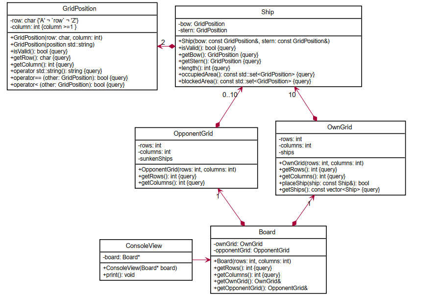
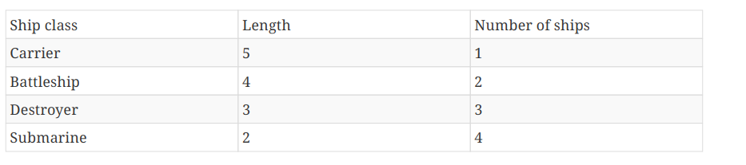
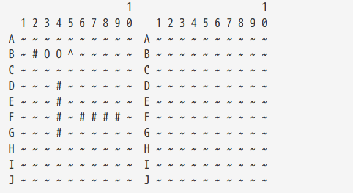
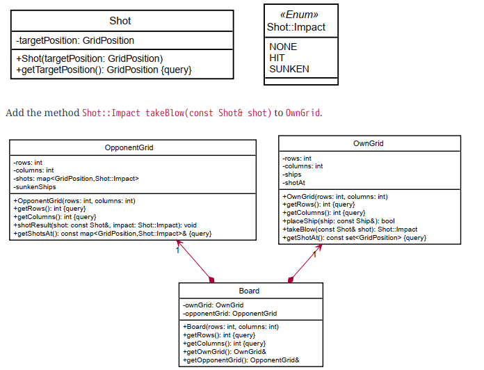

# Battleship Board Game using C++
## Objective
The aim is to create an OO model of the game Battleship [AboutBattleship](https://en.wikipedia.org/wiki/Battleship_(game)).
Further the goal is to  replace the paper, i.e. a player can arrange his ships, keep track of the opponent’s shots, and keep 
track of the results of his own shots.

## Details
* We create two 10 X 10 boards representing opponent grid and own grid. 
* The ship is placed in the grid using the inputs(head and tail grid position) from the player. 
* We keep the track of the ships in opponent grid and the own grid using console view output.

### Rules of Arrangement
* Ships may not touch each other
* The grid fields occupied by a ship form a straight line
* Ships may be positioned at the edges of the grid
* Ships must be positioned horizontally or vertically
* Each player has 10 ships as follows

### Determing Shots on the grid
We determine the result of the shots by the player and the opponents using return values. For example ,If the shot doesn’t hit a ship, the value Shot::Impact::NONE is returned. If a ship is hit,Shot::Impact::HIT is returned. If the hit is the final hit, i.e. the ship is sunk by the hit, Shot::Impact::SUNKEN is returned

## UML Diagram

* Requirement to display the own grid and opponent grid

* Requiement to update shots on board

## Testing
The implemented features are tested in the c files: part1test.cpp,part2test.cpp and part3test.cpp 
